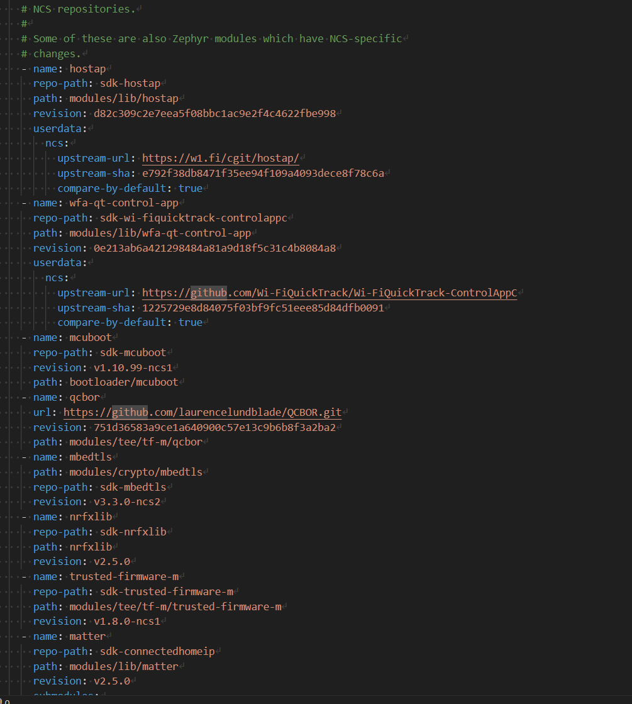

SDK version: NCS v2.5.0

# Getting started: Creating a Project from Scratch

## Introduction

Creating a project from scratch is quite simple with Zephyr. Here is a description on how to create a Hello World project. 
The goal of this tutorial is to understand the toolchain and IDE around nRF Connect and including Zephyr.

## Required Hardware/Software
- a Nordic Development Kit (e.g. nRF52DK, nRF52833DK or nRF52840DK)
- install the _nRF Connect SDK_ (NCS) v2.5.0
- install _Visual Studio Code_ as IDE
- install the _nRF Connect for VS Code extension_

The installation process can be automated through nRF Connect for Desktop.
The official installation guide is found [here](https://developer.nordicsemi.com/nRF_Connect_SDK/doc/2.5.0/nrf/installation/assistant.html).

## Step 1: Create a new Project

1) First, create a workspace directory outside your SDK installation path. This can be a directory of your choice where you keep all your future projects based on Nordic. For example: C:/NordicWorkspace

> **Note**
> It is recommended to kick off your project based on already existing application examples. In this workshop, we will start with a basic hello world project, which we will extent step-by-step.

2) Find the nRF Connect for VS Code plugin under your installed extensions, by default it is placed and found on your left side bar.  
It can be helpful to instead move the plugin to your secondary side bar (which is on your right side, and normally hidden).  
You can unhide the right side bar through: View -> Appearance --> Secondary Side Bar or use CTRL-ALT-B.  

3) Using the VS Code plugin, create your project by clicking on __Create a new application__, then click on __Copy a sample__ to create a new project based on a sample application.  

4) Select the __zephyr/samples/hello_world__ example.  

5) Confirm the directory path to copy the application example to and confirm the project name.

6) When prompted, add the application to the current workspace.

> **Note**
> Alternatively, you can also write source code beforehand, and then create a project from this. See this guide for creating project files from scratch: [Manually create the source code files](./01a_manual_files.md)

## Step 2: Understand the created files
Let us take a closer look at what files are the bare minimum of a Zephyr project, and understand their existence.

You will find:

* __main.c__   Your source code files, here the main entry point of the application (int main(void) routine) with a simple hello world print message.
* .gitignore   An optional file, and only useful if you are using version control using the popular tool Git. It masks files that should not be uploaded to a remote directory upon a git push.
* __CMakeLists.txt__   A key file of the toolchain. It is used by CMake to generate the make/ninja recipes for compilation in the next step. It creates the binding to the Zephyr SDK installation base, determines your project name, and includes all source code directories outside of the SDK code base.
* __prj.conf__   A key file of the toolchain. You will use this file to enable certain modules and libraries that are part of the SDK, but might not be needed for every project. E.g. you will enable sensor libraries here when working with sensors connected to the host MCU, or enable the Bluetooth stack if working on a Bluetooth application. A simple hello world project is minimalistic and does not require any further libraries.
* README.rst   An optional file that was copied automatically as description/guide with any sample application.
* sample.yaml   The file is mandatory for samples to automate the configuration for test cases, it was copied automatically.

### It's also worthwhile to take a look at the SDK code base and understand the dependencies. 

Take a look at the manifest file __west.yml__ inside the SDK installation directory. The file can be found inside the nrf subdirectory, e.g.: SDK/v.2.5.0/nrf/west.yml. 
 
The manifest file lists the different code repositories that are part of the nRF Connect SDK release.  
The section __remotes__ shows all external links to the Github workspaces. Under __projects__ the actual Github repositories that are part of these workspaces are defined. 
 
You will see that the nRF Connect SDK consists of various cloned Github repositories like Zephyr, MCUBoot, Mbedtls, nrfxlib and Matter.

## Step 3: Add a Build Configuration
Currently, the source code has no binding or relavance to a certain hardware target.  
By adding a build configuration we tell the build system, for which target hardware the source code shall be compiled for. The board/hardware is described in the Linux style format of a Device Tree (*.dts file).

7) With your application selected, click on __Create new build configuration__.  
Select the board / development kit you are working with, in this case the nrf52840dk_nrf52840. 
> **Note**
> The naming convention follows the rule: \<board_name>_\<target_processor>

8) Keep the remaining settings on default and hit __Build Configuration__.   With build after generating configuration being selected, it will automatically compile the project:  

## Step 4: Program the kit & Verify the Output

9) After the project build is complete, you can find your compiled binaries under: 
* Intel HEX format: /build/zephyr/zephyr.hex 
* BIN format: /build/zephyr/zephyr.bin

10) Ensure that your Nordic Development Kit is connected, and powered on. Its serial number should be listed under __Connected Devices__.  
Hit __Flash__ in the ACTIONS menu to download the binary file to the kit.

12) Open a terminal program, for example the _Serial Terminal_ that is available in _nRF Connect for Desktop_ or the open source terminal _TeraTerm_. 
Connect to the VCOM port of the DK with settings as follows: 115200 baud, 8 data bits, 1 stop bit, no parity, no flow control.

13) __Reset the kit__ using the onboard reset button. 
The Zephyr Boot message is printed, followed by a Hello World and the board's name. and "Hello World" string is shown in the terminal.   

