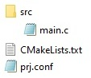

### Create required folders and files

1) First, create a workspace directory outside your SDK installation path. This can be a directory of your choice where you keep all your future projects based on Nordic. For example: C:/NordicWorkspace

2) Our first project is "Hello World". So we create a project folder __hello_world__ in our workspace directory:    C:/MyWorkspace/hello_world

    NOTE: Directory names should start with a letter and there should be no spaces in the folder name!

3) We need the following files in our project folder:

   

   NOTE: You can create these files in Windows File Explorer as follow: open a folder, then click inside this folder with the right mouse button. In context menu select "New" and "Text Document". It is important that the file extension is also changed for some files! You have to enable the file name extensions in the Windows File Explorer menu "View" and ensure a tick is set at "File name extensions".

4) Create the following three files in our project directory:

    _c:/MyWorkspace/hello_world/CMakeLists.txt_
    
       # SPDX-License-Identifier: Apache-2.0

       cmake_minimum_required(VERSION 3.20.0)

       # Find external Zephyr project, and load its settings:
       find_package(Zephyr REQUIRED HINTS $ENV{ZEPHYR_BASE})

       # Set project name:
       project (MyApp)

       # add sources
       target_sources(app PRIVATE src/main.c)             

    _c:/MyWorkspace/hello_world/prj.conf_
    
       # This line is just a comment. In this simple project we can use the default configuration. 
       
    and create main.c in the subfolder _src_ ->
         _c:/MyWorkspace/hello_world/src/main.c_
    
       #include <zephyr/kernel.h>

       void main(void)
       {
            printk("Hello World!\n");
       }
