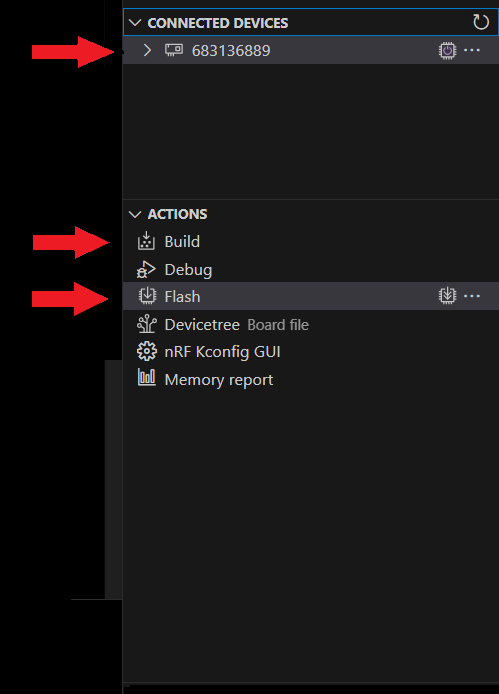
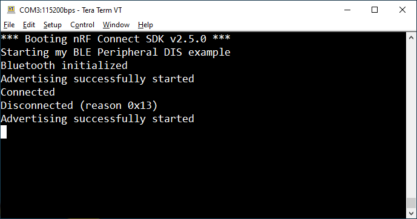

<sup>SDK version: NCS v2.5.0</sup>

# Getting started: Creating a simple BLE Beacon Application

## Introduction
In this tutorial we will extend our simple Hello World application by adding Bluetooth Low Energy functionality.<br>
We will implement a simple BLE beacon based on the iBeacon protocol.

The iBeacon protocol describes a transmitter beacon that broadcasts information to all compatible devices in its range as Manufacturer Specific Data in the advertisement packets.

The advertisement packet data consists of:
* A 128-bit UUID to identify the beacon's provider.
* An arbitrary Major value for coarse differentiation between beacons.
* An arbitrary Minor value for fine differentiation between beacons.
* The RSSI value of the beacon measured at 1 meter distance, which can be used for estimating the distance from the beacon.

## Step-by-step Tutorial

### 1) Required header files / includes:
<sup>>add to src/main.c</sup>

We will need to add two header files for printing through the Zephyr kernel (printk) and the Bluetooth API.
```
#include <zephyr/sys/printk.h>
#include <zephyr/bluetooth/bluetooth.h>
```

### 2) Construct the advertising data as per iBeacon specification:

A unique universal identifier (UUID) should be created, e.g. using https://www.uuidgenerator.net/. 
The remaining fields can be copied from below code snippet:

<sup>>add to src/main.c</sup>
```
/* Set advertising data based on iBeacon protocol. These values are for
 * demonstration purposes only and must be changed for production environments!
 * Generate a random UUID
 * Major: 1, Minor: 2
 * Transmit power estimated at ~-56dBm -> 0xC8
 */
static const struct bt_data ad[] = {
	BT_DATA_BYTES(BT_DATA_FLAGS,BT_LE_AD_NO_BREDR),  // Flags[0..3]   
	// NOTE: Length field is handled AUTOMATICALLY by BT_DATA_BYTES Macro!
	BT_DATA_BYTES(BT_DATA_MANUFACTURER_DATA,    // Type
	0x59, 0x00,  // Manufacturer ID (Nordic Semiconductor ASA)
	0x02, 0x15, // Sub Type and Length, as per iBeacon specification
	, , , ,     // Proximity UUID - UUID[15..12] 
	, ,         // Proximity UUID - UUID[11..10] 
	, ,         // Proximity UUID - UUID[9..8] 
	, ,         // Proximity UUID - UUID[7..6] 
	, , , , , , // Proximity UUID - UUID[5..0] 
	0x00, 0x01, // Major
	0x00, 0x02, // Minor
	0xC8) // Measured Power in 1m distance, 8-bit signed value (0xC8 -> -56dBm)
};
```
A randomly created UUID of _04d2d678-2c6e-4b15-abaa-fc4bd0d6855a_ results in:
```
0x04, 0xd2, 0xd6, 0x78,     // Proximity UUID - UUID[15..12] 
0x2c, 0x6e,         		// Proximity UUID - UUID[11..10] 
0x4b, 0x15,         		// Proximity UUID - UUID[9..8] 
0xab, 0xaa,         		// Proximity UUID - UUID[7..6] 
0xfc, 0x4b, 0xd0, 0xd6, 0x85, 0x5a, // Proximity UUID - UUID[5..0] 
```

### 3) Enable the Bluetooth stack inside the main routine:

<sup>>add to src/main.c</sup>

```
int main(void)
{
	int err; 
	printk("Starting My Beacon application!\n");

	/* Initialize the Bluetooth Stack */
	err = bt_enable(bt_ready);
	if (err) {
		printk("Bluetooth init failed (err %d)\n", err);
	}
	return 0;
}
```

### 4) Define the bt_ready callback function:
The function bt_enable() is non-blocking, and we are passing the required callback function as parameter. Once the Bluetooth stack has been initialized, bt_ready will be executed.<br>
In here, we will start the continuous advertising mode.

<sup>>add to src/main.c</sup>

```
/* bt ready callback function is used to enable the advertising mode */
static void bt_ready(int err){
    if (err) {
        printk("Bluetooth init failed (err %d)\n", err);
         return;
    }

    printk("Bluetooth initialized\n");

    /* Start advertising without Scan Response */
    err = bt_le_adv_start(BT_LE_ADV_NCONN, ad, ARRAY_SIZE(ad), NULL, 0);
    if (err) {
        printk("Advertising failed to start (err %d)\n", err);
        return;
    }

    printk("Beacon advertising started\n");
}
```

### 5) Enable the Bluetooth library (Kconfig)

As per Zephyr Kernel Configuration, the Bluetooth subsystem needs to be added to the project.<br> This can be done through the __nRF Kconfig GUI__ browser (save to file when done!) or manually through prj.conf.

<sup>>add to prj.conf</sup>

```
# Enable Bluetooth support
CONFIG_BT=y
```

### 7) Compile the project and flash it

Ensure that your Nordic Development Kit is connected, and powered on. Its serial number should be listed under __Connected Devices__.<br>
Hit __Built__ in the Actions menu to compile the project, then hit __Flash__ to download the binary file to the kit.



### 8) Reset the Kit and verify the serial terminal output

On the virtual COM port of the DK you should expect the following output:



### 8) Using a smartphoner to scan for the beacon
You can also scan for the beacon using your smartphone and an app. <br>
Download the nRF Connect for Mobile app on [iOS](https://apps.apple.com/de/app/nrf-connect-for-mobile/id1054362403) or [Android](https://play.google.com/store/apps/details?id=no.nordicsemi.android.mcp&hl=de&gl=US).<br>The app includes a BLE scanner that can listen for the BLE beacon, you may use a RSSI filter to only show devices that are close to you.

### 9) Extension: Enabling a Bluetooth Beacon name and debug output 

Let's give the beacon a name through adding scan response data. We will also enable the debug output of a Zephyr module, our Bluetooth stack in this case.<br>
Take a look at the required changes for the prj.conf file first:

<sup>>modify prj.conf</sup>

```
# Enable Bluetooth support
CONFIG_BT=y
# Enable Bluetooth module logs, create a device name
CONFIG_BT_DEBUG_LOG=y
CONFIG_BT_DEVICE_NAME="Test beacon"
```

> **Note**
> CONFIG_BT_DEBUG_LOG has now been deprecated. According to [Git Pull Request #56183](https://github.com/zephyrproject-rtos/zephyr/pull/56183) the logging of the Bluetooth module is automatically enabled, if both the global log symbol (CONFIG_LOG) and the Bluetooth module (CONFIG_BT) are enabled.

Add the scan response data which includes the Bluetooth device name as per Kconfig symbol.

<sup>>add to main.c, after struct bt_data ad[]</sup>

```
/* Set Scan Response data */
static const struct bt_data sd[] = {
	BT_DATA(BT_DATA_NAME_COMPLETE, CONFIG_BT_DEVICE_NAME, (sizeof(CONFIG_BT_DEVICE_NAME) - 1)),
};
```

Lastly, change the function call to start the Bluetooth advertising, include the scan reponse structure.

<sup>>modify inside bt_ready(int err) of main.c</sup>

```
/* Start advertising with Scan Response */
err = bt_le_adv_start(BT_LE_ADV_NCONN, ad, ARRAY_SIZE(ad), sd, ARRAY_SIZE(sd));
```

### 10) Extension: Compile the project and flash it

Ensure that your Nordic Development Kit is connected, and powered on. Its serial number should be listed under __Connected Devices__.<br>
Hit __Built__ in the Actions menu to compile the project, then hit __Flash__ to download the binary to the kit.

