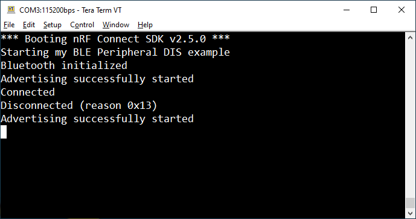

<sup>SDK version: NCS v2.5.0</sup>

# Getting started: Creating a BLE Peripheral Application

## Introduction
In most BLE use cases, you will not only rely on advertising, but instead need a connection between two devices (e.g. your device and a smartphone).<br>
The smartphone will act as BLE central device, the Nordic Development Kit will act as BLE peripheral device.<br>
In this tutorial we will implement the standardized Device Information Service (DIS), to allow the smartphone to read out basic device data.<br>
<br>
You may start with a blank application example, or use the hello world project as base.

## Step-by-step Tutorial

### 1) Add required header files / includes:
<sup>> add to src/main.c</sup>

We will need to add the following header files for our BLE Peripheral example:
```
#include <zephyr/sys/printk.h>
#include <zephyr/bluetooth/bluetooth.h>
#include <zephyr/bluetooth/uuid.h>
#include <zephyr/bluetooth/conn.h>
```

### 2) Setup the Zephyr Kernel Configuration
Firstly, enable the Bluetooth stack and set the device name and device role (peripheral).

> **Note**
> Many config symbols have a default value and are set through CMake or a board specific configuration file (see also: [here](https://docs.zephyrproject.org/latest/build/kconfig/setting.html)).

<sup>> add to prj.conf</sup><br>
Take a look at the config symbols that are activated by default (commented out here), and understand that you can also explicitly disable settings (CONFIG_[...]=n).

```
# Enable Bluetooth stack and define the device role
CONFIG_BT=y
CONFIG_BT_PERIPHERAL=y
CONFIG_BT_DEVICE_NAME="My DIS Peripheral"
#CONFIG_BT_BROADCASTER=y   # note: BROADCASTER is activated by default
#CONFIG_BT_CENTRAL=n       not used in this example (default value: n)
#CONFIG_BT_OBSERVER=n      not used in this example (default value: n)
```

### 3) Add the software module for the Device Information Service (DIS) and set its parameters
Secondly, add the DIS module and parameters that we like to share.

<sup>> add to prj.conf</sup>
```
# BLE Device Information Service (DIS)
CONFIG_BT_DIS=y
CONFIG_BT_DIS_MANUF="Zephyr"
CONFIG_BT_DIS_MODEL="Zephyr Model"
CONFIG_BT_DIS_SERIAL_NUMBER=y
CONFIG_BT_DIS_SERIAL_NUMBER_STR="Zephyr Serial"
CONFIG_BT_DIS_HW_REV=y
CONFIG_BT_DIS_HW_REV_STR="Zephyr Hardware"
CONFIG_BT_DIS_FW_REV=y
CONFIG_BT_DIS_FW_REV_STR="Zephyr Firmware"
CONFIG_BT_DIS_SW_REV=y
CONFIG_BT_DIS_SW_REV_STR="Zephyr Software"
CONFIG_BT_DIS_PNP=n
#CONFIG_BT_DIS_PNP_PID=0x00   not used in this example
#CONFIG_BT_DIS_PNP_VID=0x00   not used in this example
#CONFIG_BT_DIS_PNP_VID_SRC=1  not used in this example
#CONFIG_BT_DIS_PNP_VER=0x01   not used in this example
```

### 4) Define the advertising data set
We need to define the advertising data set. We will also define a function to start the advertising, so that this routine can be used multiple times.<br>
Note that the advertising is this time connectable.

<sup>> add to main.c</sup>

```
/* Advertising data set */
static const struct bt_data ad[] = {
    BT_DATA_BYTES(BT_DATA_FLAGS, (BT_LE_AD_GENERAL | BT_LE_AD_NO_BREDR)),
    BT_DATA_BYTES(BT_DATA_UUID16_ALL, BT_UUID_16_ENCODE(BT_UUID_DIS_VAL)),
};

/* Function to start the advertising mode */
void start_advertising(void)
{
	int err;

	err = bt_le_adv_start(BT_LE_ADV_CONN_NAME, ad, ARRAY_SIZE(ad), NULL, 0);
	if (err) {
		printk("Advertising failed to start (err %d)\n", err);
	}
	else {
		printk("Advertising successfully started\n");
	}
}
```

### 5) Add handling of connect/disconnect events
It is useful to trigger actions based on a successful connection or disconnect. Once we are connected, we can print out this state or a possible error.<br>
Once we are disconnected, we may want to advertise again in order to allow for a new connection.<br>
To do so, we will add corresponding callback functions.

<sup>_> add to main.c_</sup>

```
/* Callback function that triggers upon BLE connection */
static void connected(struct bt_conn *conn, uint8_t err)
{
	if (err) {
		printk("Connection failed (err 0x%02x)\n", err);
	} else {
		printk("Connected\n");
	}
}

/* Callback function that triggers upon BLE disconnect event */
static void disconnected(struct bt_conn *conn, uint8_t reason)
{
	printk("Disconnected (reason 0x%02x)\n", reason);
	start_advertising();
}

/* Structure to hold the connection callback functions */
static struct bt_conn_cb conn_callbacks = {
	.connected = connected,
	.disconnected = disconnected,
};
```

### 6) Enable the Bluetooth stack and run the application
Finally, we have to glue everything together and define the main application routine (int main(void)).

<sup>_> add to main.c - int main(void)_</sup>

```
int err;
printk("Starting my BLE Peripheral DIS example\n");
```

We will register the callback functions, previously defined under the bt_conn_cb struct.
```
/* Register a callback structure for connection events. */
bt_conn_cb_register(&conn_callbacks);
```
Next, we will initialize the Bluetooth stack. In this case, we are not passing a callback function, thus waiting for completion / blocking.
```
/* Initialize the Bluetooth Subsystem */
err = bt_enable(NULL);
if (err) {
	printk("Bluetooth init failed (err %d)\n", err);
	return 1;
}
```
Upon success, we'll continue and call the start_advertising routine to begin advertising.

```
printk("Bluetooth initialized\n");
start_advertising();
```

Your main() routine should now look as follows:


### 7) Compile the project and flash it

Ensure that your Nordic Development Kit is connected, and powered on. Its serial number should be listed under __Connected Devices__.<br>
Hit __Built__ in the Actions menu to compile the project, then hit __Flash__ to download the binary file to the kit.


### 8) Reset the Kit and verify the serial terminal output

On the virtual COM port of the DK you should see the following output:

