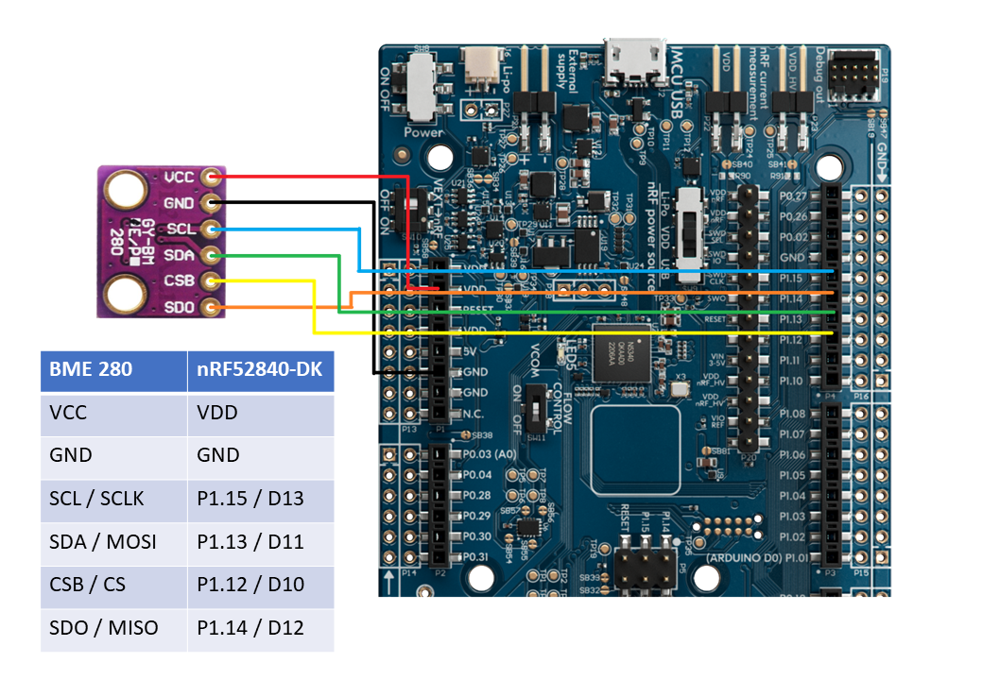
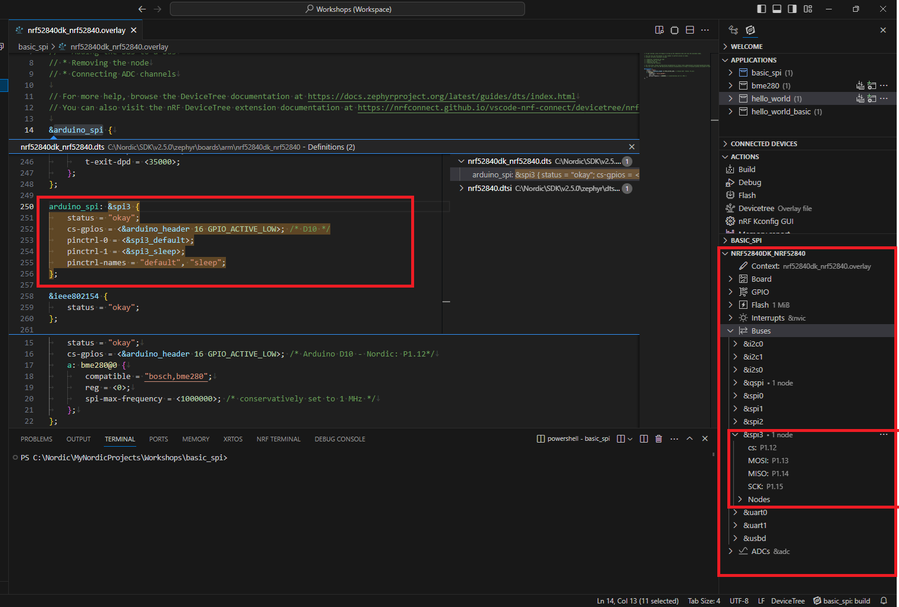
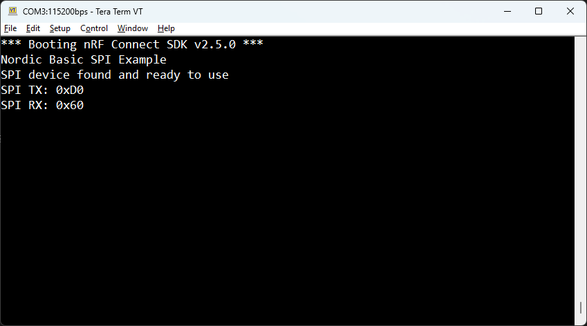

<sup>SDK version: NCS v2.5.0</sup>

# Getting started: Basic SPI example interfacing the BME280 sensor

## Introduction
This example course teaches you to use the Zephyr SPI driver and perform a basic SPI read. We will read the chip ID register of the BME280 sensor.<br>
You may start with a blank application example, or use the hello world project as base. Also, take note of the [BME280 datasheet](https://www.bosch-sensortec.com/media/boschsensortec/downloads/datasheets/bst-bme280-ds002.pdf).

## Hardware Requirements:
* Nordic Developmentkit (nRF52840-DK used here)
* BME280 Breakout Board with SPI support (e.g. from reichelt Elektronik: [BME280](https://www.reichelt.de/dk/en/developer-boards-temperature-humidity-and-pressure-sensor-bm-debo-bme280-p253982.html?r=1))
* 6 Pin jumper cables (male to female)

## Step-by-step Tutorial

### 1) SPI Connection
Connect the BME280 breakout board to the nRF52840-DK as shown below. <br>
We will utilize the Arduino style pins on the DK, and the already configured SPI interface on these (Arduino: D10-D13, Nordic: P1.12-P1.15).<br>
The arduino_spi interface is a remapped interface of spi3 on the nRF52840 SoC. It is labeled arduino_spi to create SW compatbility between different boards.

> **Note**
> You can also connect this specific BME280 breakout board via I2C. Therefore, connect CSB and SDO to VDD, and use the other pins as marked on the BME280 board.



You can track down the pin configuration of a board using the built-in VS Code plugin of Nordic (bottom right corner, explore the board file/*.dts) or track down the defined pins via the pinctrl definitions in the device tree files directly.



### 2) Create Device Tree overlay file

We will need to create a device tree file overlay to define a node on the SPI bus, which is our SPI device, the BME280. <br>

Inside the root project folder, create a file named __nRF52840dk_nRF52840.overlay__. <br>
You may also use the VS Code GUI, under Your application/project name -> Config files -> Devicetree -> No overlay files --> Click to create one.

> **Note**
> Overlay files can have different names, but an overlay file that has the exact same name as our board file, and is in the project root folder will be used automatically during the build process. This simplifies the usage.

<sup>>add to nRF52840dk_nRF52840.overlay</sup>

```
&arduino_spi {
	status = "okay";
	cs-gpios = <&arduino_header 16 GPIO_ACTIVE_LOW>; /* Arduino D10 - Nordic: P1.12*/
	spidev: bme280@0 {
		compatible = "bosch,bme280";
		reg = <0>;
		spi-max-frequency = <1000000>; /* conservatively set to 1 MHz */
	};
};
```

The interface itself is already described (see previous chapter), and by default it also active on the nRF52840DK. Nevertheless, its good practice to still put down the status okay line to mark that we are actively enabling and using this interface. The spidev label is used to access this specific SPI device. The ``<reg>`` property of the SPI bus specifies the id of the device on the bus, also ``<cs-gpios>`` is a list, and could technically include multiple entries for the devices that are selected through different chip select lines. The id numbering starts with 0.

### 3) Setup the Zephyr Kernel Configuration

Enable the Zephyr SPI driver through a kernel configuration setting in our prj.conf. The board file might already enable the SPI driver, but again its good practice to do this step, as other board files might not do so.

<sup>>add to prj.conf</sup>

```
CONFIG_SPI=y
```

### 4) Creating our application: Headers/Includes
Assuming we are starting from a blank application / hello world example, we will need to add the following header files for our basic SPI example:
<sup>> add to src/main.c</sup>
```
#include <zephyr/kernel.h>
#include <zephyr/device.h>
#include <zephyr/drivers/spi.h>
```

### 5) Setting up the SPI configuration

We need the pointer to our SPI device, which we will retrieve through the device tree get macros. Here we are using the arduino_spi label, so this code can be reused if on another hardware arduino_spi is on a different SPI interface. We will also intialize a structure to hold the SPI configuration settings, like frequency, operation mode and the chip select line definition.

<sup>> add to src/main.c</sup>

```
const struct device *spi = DEVICE_DT_GET(DT_NODELABEL(arduino_spi));

struct spi_config spi_cfg = {
	.frequency = 1000000U,
	.operation = SPI_WORD_SET(8)|SPI_OP_MODE_MASTER,
	.slave = 0,
	.cs = SPI_CS_CONTROL_INIT(DT_NODELABEL(spidev), 2)
};
```

### 6) Set up the SPI buffers
We will setup the SPI TX and RX buffers for the Zephyr SPI driver. Why TX? To read out a register of the BME280, we will first need to perform an SPI write of the target address we want to read. The [datasheet](https://www.bosch-sensortec.com/media/boschsensortec/downloads/datasheets/bst-bme280-ds002.pdf) says that the chip id register is found at address 0xD0, and its value is 0x60.

<sup>> add to src/main.c</sup>
```
int main(void)
{
	int ret;
	printk("Nordic Basic SPI Example\n");

	/* SPI TX Buffer Settings */
	uint8_t addr = 0xD0; //read out chip ID, at register D0, normally BITWISE OR with 0x80, see BME280 datasheet
	struct spi_buf tx_buf = {.buf = &addr, .len = 1};
	const struct spi_buf_set tx = {.buffers = &tx_buf, .count = 1};

	/* SPI RX Buffer Settings */
	static uint8_t rx_buffer[1];
	struct spi_buf rx_buf[2];
	rx_buf[0].len = 1;
	rx_buf[0].buf = NULL;
	rx_buf[1].len = 1;
	rx_buf[1].buf = &rx_buffer[0]; //address of our buffer is handed over
	const struct spi_buf_set rx = {.buffers = rx_buf, .count = ARRAY_SIZE(rx_buf)};
}
```

> **Note**
> You may ask yourself why we are using 2 byte RX buffer for the SPI and disregarding the first byte. The answer is: We are using SPI in full duplex mode, means while we TX the address, we are already reading on the receiving side. But at this stage the BME280 has not yet responded.

### 7) Check if SPI device is found and ready to use
Perform a sanity check on our device pointer before using it. This will check if the device tree bindings are correct, and we can access the SPI peripheral of the SoC before proceeding.

<sup>> add to src/main.c, int main(void)</sup>
```
if (spi == NULL) {
    /* No such node, or the node does not have status "okay". */
    printk("Error: no device found\n");
    return 0;
}

if (!device_is_ready(spi)) {
    printk("Error: SPI device not ready\n");
    return 0;
}
printk("SPI device found and ready to use\n");
```

### 8) Perform the SPI transceive and read out the result
We are now ready to call spi_transceive, with our previously configured spi_config and our buffers.

<sup>> add to src/main.c, int main(void)</sup>
```
ret = spi_transceive(spi, &spi_cfg, &tx, &rx);
if (ret) {
    printk("spi_transceive FAIL %d\n", ret);
    return 0;
}
/* Output results */
printk("SPI TX: 0x%.2X\n", addr);
printk("SPI RX: 0x%.2X\n", rx_buffer[0]);
```

### 9) Compile the project and flash the program

Ensure that your Nordic Development Kit is connected, and powered on. Its serial number should be listed under __Connected Devices__.<br>
Hit __Built__ in the Actions menu to compile the project, then hit __Flash__ to download the binary file to the kit.


### 10) Reset the Kit and verify the serial terminal output

On the virtual COM port of the DK you should see the following output. We read the BME280 chip id from register 0xD0, the value should be: 0x60.

