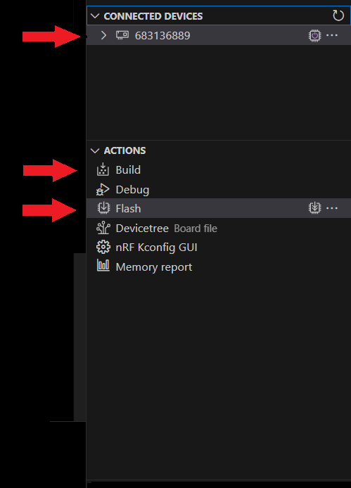

<sup>SDK version: NCS v2.5.0</sup>

# Getting started: Interfacing the BME280 sensor via SPI

In this example we will interface the BME280 sensor via SPI and periodically read out the sensor data. We will leverage the benefits of the Zephyr project and the fact that the BME280 driver is fully integrated already.<br>
Your application code will actually look simpler compared to the [basic SPI example](./04_BME280_basic_SPI.md) where we have only read a single register from the BME280.<br>
<br>
You may start with a blank code example / hello world project.

## Hardware Requirements:
* Nordic Developmentkit (nRF52840-DK used here)
* BME280 Breakout Board with SPI support (e.g. from reichelt Elektronik: [BME280](https://www.reichelt.de/dk/en/developer-boards-temperature-humidity-and-pressure-sensor-bm-debo-bme280-p253982.html?r=1))
* 6 Pin jumper cables (male to female)

## Step-by-step Tutorial

### 1) SPI Connection
Connect the BME280 breakout board to the nRF52840-DK as shown below.

> **Note**
> If you have completed the previous chapter already, you can skip ahead to Step 3).

We will utilize the Arduino style pins on the DK, and the already configured SPI interface on these (Arduino: D10-D13, Nordic: P1.12-P1.15).<br>
The arduino_spi interface is a remapped interface of spi3 on the nRF52840 SoC. It is labeled arduino_spi to create SW compatbility between different boards.


You can track down the pin configuration of a board using the built-in VS Code plugin of Nordic (bottom right corner, explore the board file/*.dts) or track down the defined pins via the pinctrl definitions in the device tree files directly.<br>
See [basic SPI example](./04_BME280_basic_SPI.md) for an example.

### 2) Create Device Tree overlay file

We will need to create a device tree file overlay to define a node on the SPI bus, which is our SPI device, the BME280. <br>

Inside the root project folder, create a file named __nRF52840dk_nRF52840.overlay__. <br>
You may also use the VS Code GUI, under Your application/project name -> Config files -> Devicetree -> No overlay files --> Click to create one.

> **Note**
> Overlay files can have different names, but an overlay file that has the exact same name as our board file, and is in the project root folder will be used automatically during the build process. This simplifies the usage.

<sup>>add to nRF52840dk_nRF52840.overlay</sup>

```
&arduino_spi {
	status = "okay";
	cs-gpios = <&arduino_header 16 GPIO_ACTIVE_LOW>; /* Arduino D10 - Nordic: P1.12*/
	spidev: bme280@0 {
		compatible = "bosch,bme280";
		reg = <0>;
		spi-max-frequency = <1000000>; /* conservatively set to 1 MHz */
	};
};
```

The interface itself is already described (see previous chapter), and by default it also active on the nRF52840DK. Nevertheless, its good practice to still put down the status okay line to mark that we are actively enabling and using this interface. The spidev label is used to access this specific SPI device. The ``<reg>`` property of the SPI bus specifies the id of the device on the bus, also ``<cs-gpios>`` is a list, and could technically include multiple entries for the devices that are selected through different chip select lines. The id numbering starts with 0.

### 3) Setup the Zephyr Kernel Configuration

In this tutorial we will utilize the BME280 driver that is part of Zephyr. Under the hood, this driver interfaces the Zepyhr SPI driver, which then accesses the Nordic specific SPI drivers. We tell the driver that we use SPI only due to the fact that we have a BME280 compatible node under the SPI bus as specified in our device tree / overlay. In terms of kernel configuration, we need to enable the Zephyr sensor library. The SPI driver is automatically loaded with the nRF52840-DK, but you can add it here as well.

<sup>>add to prj.conf</sup>

```
CONFIG_SPI=y
CONFIG_SENSOR=y
```

### 4) Creating our application: Headers/Includes
Assuming we are starting from a blank application / hello world example, we will need to add the following header files for our basic SPI example:
<sup>> add to src/main.c</sup>
```
#include <zephyr/kernel.h>
#include <zephyr/device.h>
#include <zephyr/drivers/sensor.h>
```

### 5) Access the sensor device in our application

As with other devices and Zephyr we can access our peripheral / hardware through a device pointer. We retrieve the pointer based on information from the device tree file.
<br> We will perform a sanity check on the received pointer, before proceeding. Construct the main application routine as follows:

<sup>> add to src/main.c</sup>

```
int main(void)
{
    /* Get device pointer to BME280 sensor from any compatible node in the device tree */
    const struct device *dev = DEVICE_DT_GET_ANY(bosch_bme280);
    if (dev==NULL){
        /* No such node, or the node does not have status "okay". */
        printk("\nError: no device found.\n");
        return 0;
    }
    if (!device_is_ready(dev)) {
		printk("\nError: Device \"%s\" is not ready; check the driver initialization logs for errors.\n", dev->name);
		return 0;
	}
    printk("Found device \"%s\", getting sensor data\n", dev->name);
}
```

### 6) Periodically fetch the sensor data and output the values to the console

<sup>> add to src/main.c, append to int main(void)</sup>

```
while (1) {
    struct sensor_value temp, press, humidity;

    sensor_sample_fetch(dev);
    sensor_channel_get(dev, SENSOR_CHAN_AMBIENT_TEMP, &temp);
    sensor_channel_get(dev, SENSOR_CHAN_PRESS, &press);
    sensor_channel_get(dev, SENSOR_CHAN_HUMIDITY, &humidity);

    printk("temp: %d.%06d; press: %d.%06d; humidity: %d.%06d\n",
            temp.val1, temp.val2, press.val1, press.val2,
            humidity.val1, humidity.val2);

    k_sleep(K_MSEC(1000));
}
return 0;
```

### 9) Compile the project and flash the program

Ensure that your Nordic Development Kit is connected, and powered on. Its serial number should be listed under __Connected Devices__.<br>
Hit __Built__ in the Actions menu to compile the project, then hit __Flash__ to download the binary file to the kit.



### 10) Reset the Kit and verify the serial terminal output

On the virtual COM port of the DK you should see the following output. We are periodically fetching the BME280 sensor data.

